# IoT Battlefield - Confluent Platform Demo

A comprehensive real-time data streaming demonstration using Confluent Platform to simulate a battlefield scenario with troops, tanks, and Front Line Command (FLC) centers. This demo showcases event streaming, stream processing, and real-time analytics capabilities.

## 🎯 Overview

This demo emulates a battlefield environment where:
- **Troops** (200 units) report bio-vital signs (pulse rate, body temperature), injury status, ammunition levels, and GPS positions
- **Tanks** (100 units) transmit damage status, ammunition levels, and GPS coordinates
- **Front Line Command Centers** (11 locations) monitor supply levels (food, ammunition, health supplies)

All data streams through Apache Kafka, gets processed by ksqlDB, and is visualized in Kibana dashboards and PostgreSQL database.

## 🏗️ Architecture

### Components

- **Apache Kafka** (KRaft mode) - Event streaming platform
- **Schema Registry** - Avro schema management
- **ksqlDB** - Stream processing engine
- **Kafka Connect** - Data integration framework
  - Elasticsearch Sink Connector
  - JDBC Sink Connector (PostgreSQL)
- **Confluent Control Center** - Management and monitoring UI
- **Elasticsearch & Kibana** - Real-time dashboards and analytics
- **PostgreSQL & pgAdmin** - Relational database for injured/deceased troops and destroyed tanks
- **Prometheus & Alertmanager** - Metrics and alerting

### Data Flow

```
Emulator (Python) → (Input) Kafka Topics → ksqlDB Processing → (Output) Kafka Topics → Sinks
                                                                                        ├─→ Elasticsearch/Kibana
                                                                                        └─→ PostgreSQL
```

### Kafka Topics

- `iot_battlefield_troops` - Troop deployment and status data
- `iot_battlefield_troops_moves` - Troop movement events
- `iot_battlefield_tanks` - Tank deployment and status data
- `iot_battlefield_tanks_moves` - Tank movement events
- `iot_battlefield_flc` - Front Line Command status
- `iot_battlefield_flc_moves` - FLC supply level changes

### ksqlDB Processing

The demo includes sophisticated stream processing with the following ksqlDB statements (executed in order):

#### Troops Processing

1. **000_TABLE-TROOPS.sql** - Creates troops state table
   - **Input**: `iot_battlefield_troops` topic
   - **Purpose**: Maintains current state of each troop (name, rank, blood type, etc.)
   - **Type**: TABLE (keyed by troop ID)

2. **001_STREAM-TROOPS_MOVES.sql** - Creates troops movement stream
   - **Input**: `iot_battlefield_troops_moves` topic
   - **Purpose**: Captures real-time troop movements and status updates
   - **Type**: STREAM

3. **002_STREAM-TROOPS.sql** - Joins troops data with movements
   - **Input**: `iot_battlefield_troops_moves` (stream) + `iot_battlefield_troops` (table)
   - **Output**: `iot_battlefield_troops-joined` stream
   - **Purpose**: Enriches movement data with static troop information (name, rank, blood type)
   - **Type**: STREAM (join result)

4. **003_STREAM-TROOPS_INJURED.sql** - Filters injured troops
   - **Input**: `iot_battlefield_troops-joined` stream
   - **Output**: `iot_battlefield_troops-injured` stream
   - **Purpose**: Identifies troops with injuries (WHERE injury IS NOT NULL)
   - **Type**: STREAM (filtered)

5. **004_STREAM-TROOPS_DECEASED.sql** - Filters deceased troops
   - **Input**: `iot_battlefield_troops-joined` stream
   - **Output**: `iot_battlefield_troops-deceased` stream
   - **Purpose**: Identifies deceased troops (WHERE deceased = true)
   - **Type**: STREAM (filtered)

#### Tanks Processing

6. **100_TABLE-TANKS.sql** - Creates tanks state table
   - **Input**: `iot_battlefield_tanks` topic
   - **Purpose**: Maintains current state of each tank (unit, model)
   - **Type**: TABLE (keyed by tank ID)

7. **101_STREAM-TANKS_MOVES.sql** - Creates tanks movement stream
   - **Input**: `iot_battlefield_tanks_moves` topic
   - **Purpose**: Captures real-time tank movements and damage updates
   - **Type**: STREAM

8. **102_STREAM-TANKS.sql** - Joins tanks data with movements
   - **Input**: `iot_battlefield_tanks_moves` (stream) + `iot_battlefield_tanks` (table)
   - **Output**: `iot_battlefield_tanks-joined` stream
   - **Purpose**: Enriches movement data with static tank information (unit, model)
   - **Type**: STREAM (join result)

9. **103_STREAM-TANKS_DESTROYED.sql** - Filters destroyed tanks
   - **Input**: `iot_battlefield_tanks-joined` stream
   - **Output**: `iot_battlefield_tanks-destroyed` stream
   - **Purpose**: Identifies destroyed tanks (WHERE destroyed = true)
   - **Type**: STREAM (filtered)

#### Front Line Command Processing

10. **200_TABLE-FLC.sql** - Creates FLC state table
    - **Input**: `iot_battlefield_flc` topic
    - **Purpose**: Maintains current state of each FLC (city, location)
    - **Type**: TABLE (keyed by FLC ID)

11. **201_STREAM-FLC_MOVES.sql** - Creates FLC updates stream
    - **Input**: `iot_battlefield_flc_moves` topic
    - **Purpose**: Captures real-time FLC supply level changes
    - **Type**: STREAM

12. **202_STREAM-FLC.sql** - Joins FLC data with updates
    - **Input**: `iot_battlefield_flc_moves` (stream) + `iot_battlefield_flc` (table)
    - **Output**: `iot_battlefield_flc-joined` stream
    - **Purpose**: Enriches supply updates with static FLC information (city, location)
    - **Type**: STREAM (join result)

**Key Processing Patterns:**
- **Tables**: Store static entity information (troops, tanks, FLC metadata)
- **Streams**: Capture time-series events (movements, status changes)
- **Joins**: Enrich transactional data with reference data
- **Filtering**: Route specific events (injuries, casualties, destruction) to dedicated streams

## 🚀 Quick Start

### Prerequisites

- Docker Desktop installed and running
- Python 3.x (for opening browser tabs)
- At least 8GB RAM allocated to Docker
- Ports available: 5050, 5601, 8081, 8083, 8088, 9021, 9092, 9200, 5432

### Starting the Demo

```bash
./start_demo.sh
```

This script will:
1. Start all Docker containers
2. Wait for services to be ready
3. Automatically open browser tabs for:
   - Confluent Control Center: http://localhost:9021/
   - Kibana Dashboard: http://localhost:5601/
   - pgAdmin: http://localhost:5050/

### Stopping the Demo

```bash
./stop_demo.sh
```

## 📊 Accessing the Dashboards

### Confluent Control Center
**URL**: http://localhost:9021/

Monitor and manage:
- Kafka topics and messages
- ksqlDB queries and streams
- Kafka Connect connectors
- Cluster health and metrics

### Kibana
**URL**: http://localhost:5601/

Pre-configured dashboards for:
- Main battlefield overview
- Troop facts and history
- Tank facts and history
- Front Line Command status

### pgAdmin
**URL**: http://localhost:5050/

**Credentials**:
- Email: `admin@admin.org`
- Password: `admin`

**Database Connection**:
- Host: `postgres`
- Port: `5432`
- Database: `postgres`
- Username: `postgres`
- Password: `postgres`

View tables:
- `iot_battlefield_troops-injured` - Injured troops
- `iot_battlefield_troops-deceased` - Deceased troops
- `iot_battlefield_tanks-destroyed` - Destroyed tanks

## 🎮 Demo Scenarios

### Troop Monitoring
- Real-time bio-vital signs (pulse rate, body temperature)
- Injury detection and classification (leg, arm, belly, chest, neck, head)
- Ammunition tracking
- GPS position tracking
- Casualty reporting

### Tank Operations
- Damage assessment and accumulation
- Destruction detection (when damage exceeds threshold)
- Ammunition levels
- Movement tracking across battlefield

### Front Line Command
- Supply level monitoring (food, ammunition, health)
- Multi-location tracking (11 FLC centers)
- Resource depletion alerts

## 🔧 Configuration

### Environment Variables
Edit `.env` file to customize:
- Confluent Platform version
- Component versions (Elasticsearch, Kibana, PostgreSQL)
- Platform architecture (linux/arm64 or linux/amd64)

### Unit Configuration
Customize deployment parameters in YAML files:

- `src/config/troops.yaml` - Troop units, bio-vitals, injury parameters
- `src/config/tanks.yaml` - Tank models, damage parameters
- `src/config/flc.yaml` - FLC locations, supply levels

### Deployment Units

**Troops**: Luhansk (100 units), Mariupol (100 units)
**Tanks**: Luhansk (50 units), Mariupol (50 units)
**FLC Centers**: Luhansk, Mariupol, Kyiv, Uman, Cherkasy, Sumy, Kharkiv, Zaprizhzhia, Svatove, Shoshka, London

## 📸 Screenshots

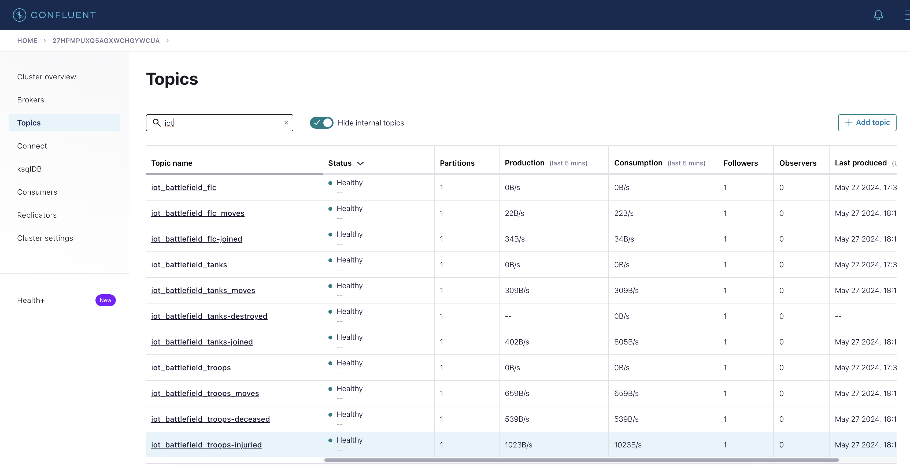
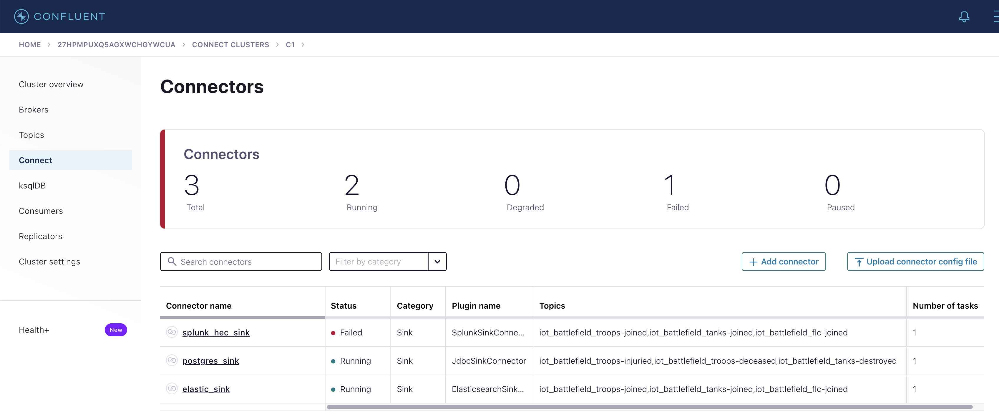
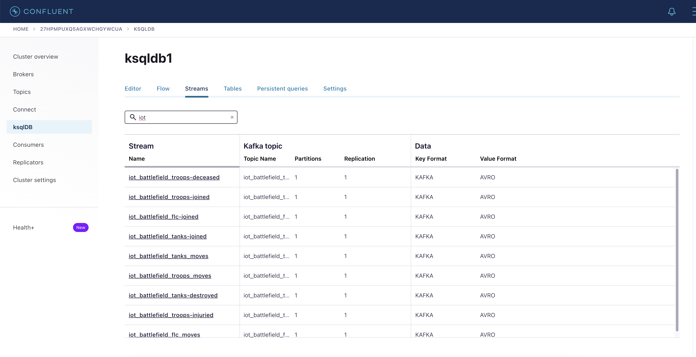
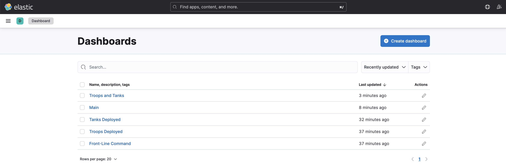
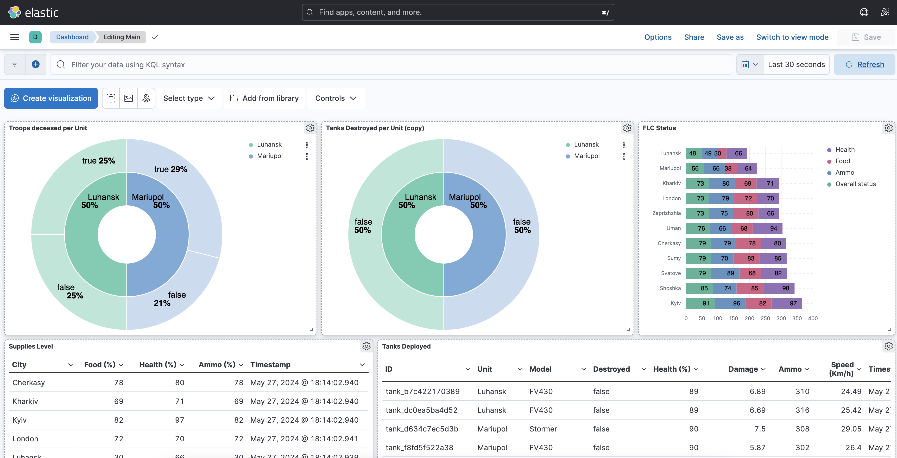
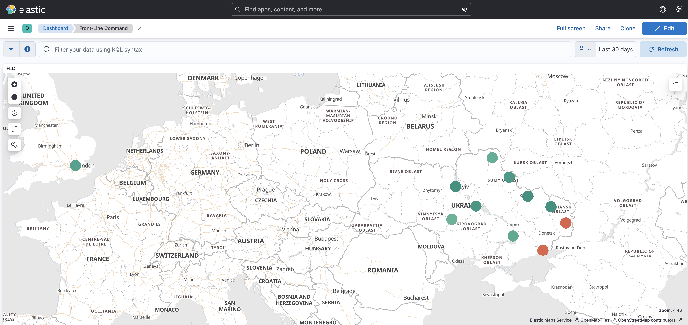
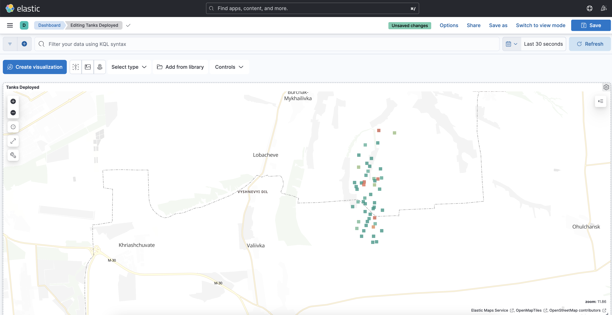
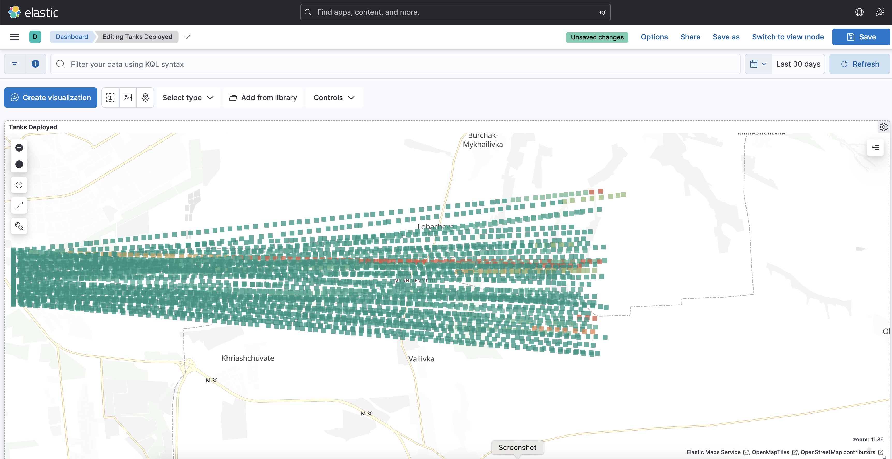
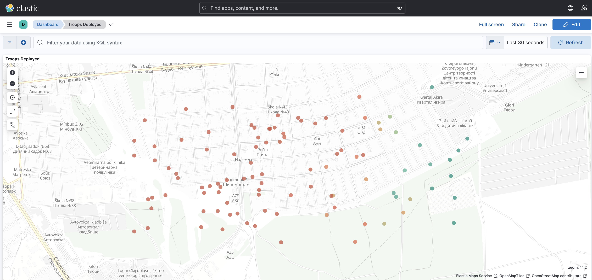
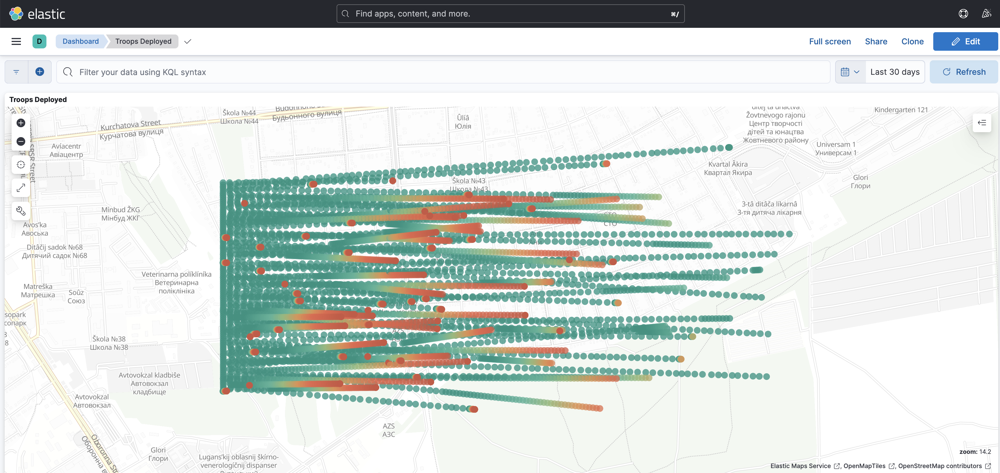
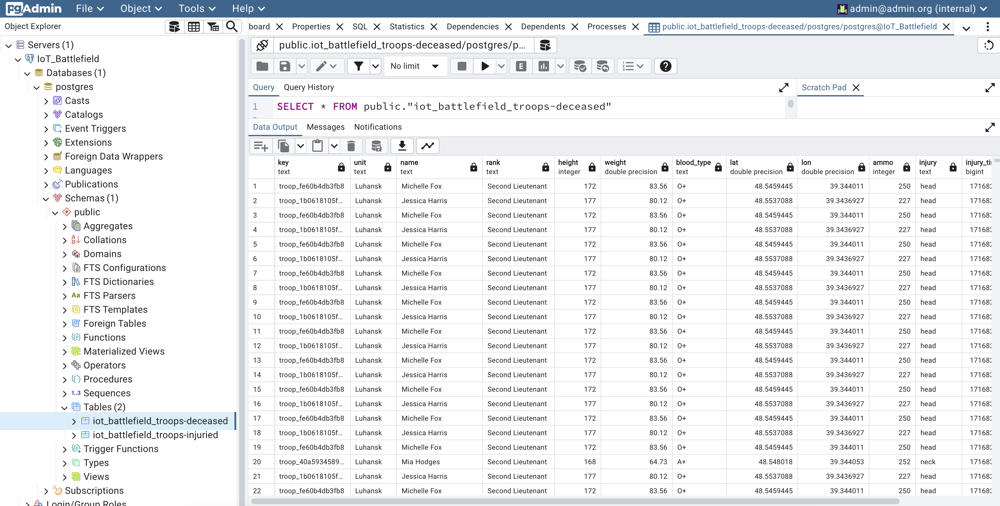
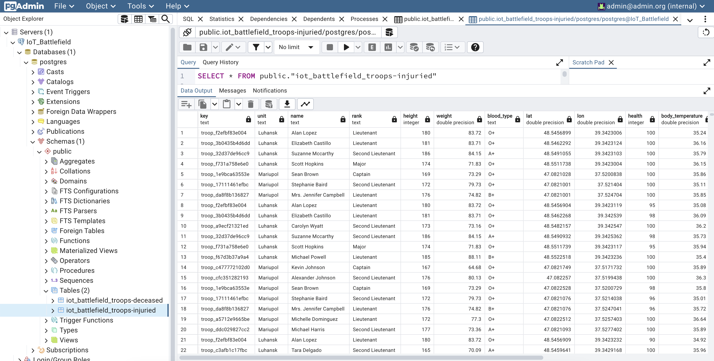

## 🛠️ Technical Details

### Data Formats
- **Serialization**: Apache Avro with Schema Registry
- **Key Format**: String (entity IDs)
- **Value Format**: Avro (structured data)

### Stream Processing
- Real-time joins between movement and state data
- Stateful aggregations for damage tracking
- Event-time processing with watermarks
- Filtering and routing based on conditions

### Connectors
- **Elasticsearch Sink**: Real-time indexing for Kibana visualization
- **JDBC Sink**: Persisting critical events (injuries, casualties, destruction) to PostgreSQL

## 🐛 Troubleshooting

### Services Not Starting
- Ensure Docker Desktop is running
- Check available disk space and memory
- Verify no port conflicts

### Data Not Appearing
- Check connector status in Control Center
- Verify ksqlDB queries are running
- Check Elasticsearch indices in Kibana

### Performance Issues
- Increase Docker memory allocation
- Reduce number of deployed units in YAML configs
- Adjust `seconds_between_moves` to reduce event frequency

## 📚 Learning Resources

This demo showcases:
- Event-driven architecture
- Stream processing patterns
- Real-time analytics
- Data integration with Kafka Connect
- Schema evolution with Schema Registry
- Monitoring and observability

## 🔗 External References

Check out [Confluent's Developer Portal](https://developer.confluent.io) for:
- Free courses on Apache Kafka and stream processing
- Documentation and tutorials
- Articles, blogs, and podcasts
- Community resources

**Disclaimer**: I work for Confluent :wink:

## 📝 License

See [LICENSE](LICENSE) file for details.

## 🤝 Contributing

This is a demonstration project. Feel free to fork and customize for your own use cases!
